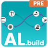

# AL.build for Azure DevOps

## YAML pipeline templates

This repository is used to provide common used YAML pipeline template for Azure DevOps, based in `AL.build` for Azure DevOps Extension.

## Overview

With `AL.build`, the struggle to create your CI/CD and Release pipelines in Azure DevOps is finally over. `AL.build` is a powerful Azure DevOps extension that delivers everything you need to set up your automated pipelines with no effort.

><strong>Good to know:</strong> Explore AL.build for Azure DevOps at no cost using the free 30-day trial period with no feature limitations.

### Features and Capabilities

 - **Build pipeline tasks**: Pipeline tasks for build pipelines specifically designed for Microsoft Dynamics 365 Business Central AL development.

 - **Release pipeline tasks**: Pipeline tasks for release pipelines to release and deploy your AL application to the Microsoft AppSource marketplace, Microsoft Dynamics 365 Business Central Online (SaaS) Sandbox and Production environments, and Microsoft Dynamics 365 Business Central On-Premise environments.

 - **Ready to build**: Set up your CI/CD process in less than 10 minutes. From zero to automation hero, as easy as 1-2-3.

 - **Documentation**: Find our complete documentation at https://docs.365businessdev.com to learn more.

## Why AL.build for Azure DevOps

You're right, there are already some other extensions and products available, like *AL-Go for GitHub*. It's great! Honestly! However, you need to spend a lot of effort to set up your processes. It's more than just a pipeline, and so the idea of `AL.build` emerged.

The `AL.build` for Azure DevOps approach is a little different. We're not just focusing on build and release pipelines, but we also offer processes to implement successful branch strategies, pull request handling, release approvals and more. The `AL.build` for Azure DevOps extension is just one piece.

## Get started

Very soon, we will add more information on how to start. Currently, we're preparing to go live with `AL.build` for Azure DevOps. Stay tuned . . .